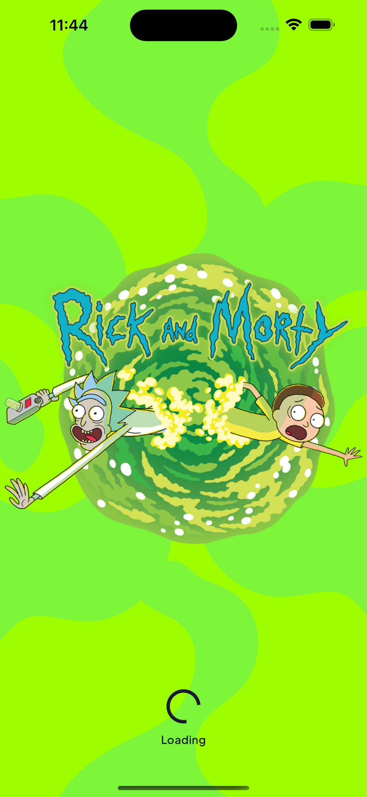
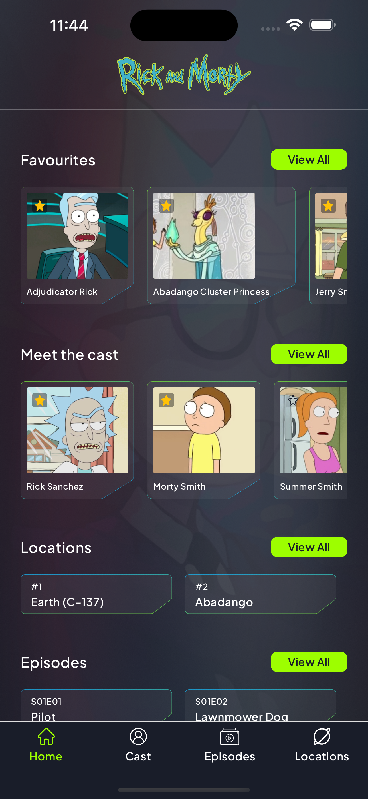
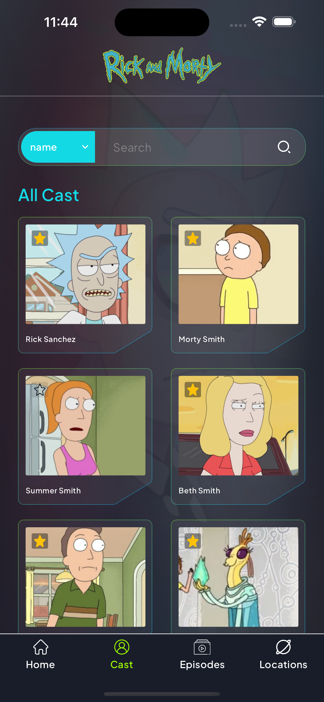
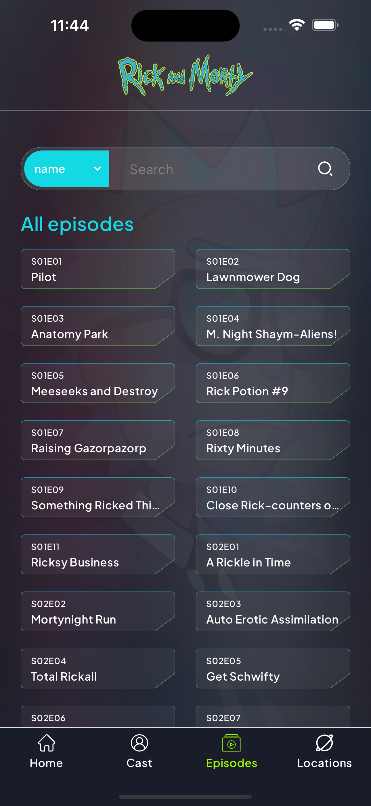
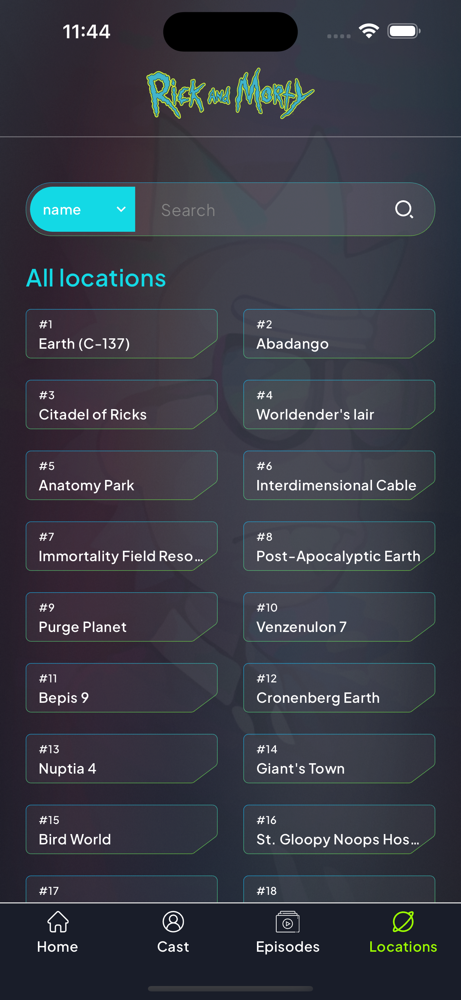
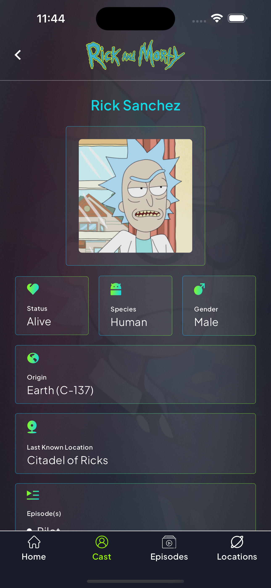
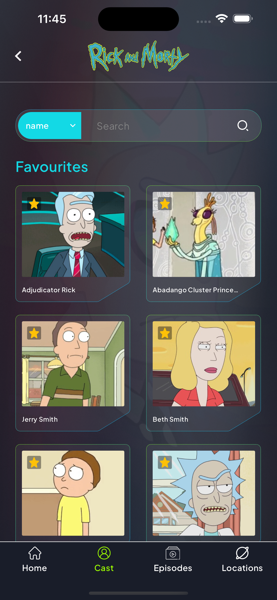
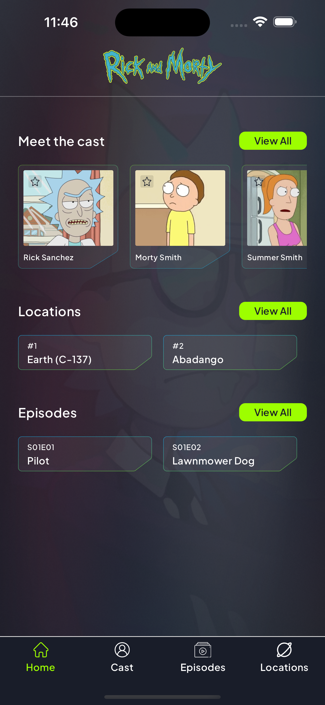

# About

A simple Flutter app that displays Rick and Morty Character Details fetched from GraphQl API using Bloc State Management.

#### Installation

In the command terminal, run the following commands:

    $ git clone https://github.com/Jashem/rick_and_morty_wiki.git
    $ cd rick_and_morty_wiki
    $ flutter run

# Features 🎯

- The 'Main' tab screen displays 4 tabs navigatable from bottom navigation bar.
- The 'Home' screen displays 4 horizontal lists of favourite casts, casts, locations, episodes fetched from a GraphQL api
- Clicking on favourite icon on cast card adds cast to local storage and shows on favourite list
- Clicking on any cast card navigates the user to the "Cast Details" screen
- Implemented state management using Bloc pattern
- Utilized a component-wise design pattern to promote code modularity and reusability
- Fetched rick and morty data using HTTP requests from a GraphQL API using dio package
- Made the app responsive for different screen sizes and orientations

### Download

#### Get it on Google Drive

<div>
<a href='https://drive.google.com/file/d/1b_YeZvE9AOdlyTx-zDemAGBSDnBROOlf/view?usp=sharing' target='_blank'></a>
</div>

## Project Config Roadmap

All the necessary config and dependencies have already been set and ready for use but there is an explanation of each step if you want to know more about the pre-config or customize it.

Initialize the Flutter project, add all the necessary dependencies mentioned above in the **pubspec.yaml** configuration file and run `pub get`.

**pubspec.yaml**

```yaml
dependencies:
  flutter:
    sdk: flutter
  cupertino_icons: ^1.0.6
  auto_route: ^8.0.3
  flutter_svg: ^2.0.10+1
  collection: ^1.18.0
  flutter_bloc: ^8.1.5
  dio: ^5.4.2+1
  freezed_annotation: ^2.4.1
  json_annotation: ^4.8.1
  dartz: ^0.10.1
  get_it: ^7.6.7
  shared_preferences: ^2.2.2

dev_dependencies:
  flutter_test:
    sdk: flutter
  flutter_lints: ^3.0.2
  build_runner: ^2.4.9
  auto_route_generator: ^8.0.0
  freezed: ^2.4.7
  json_serializable: ^6.7.1
```

#### Screenshots

<table>
    <tr>
        <td></td>
        <td></td>
    </tr>
    <tr>
        <td></td>
        <td></td>
    </tr>
    <tr>
        <td></td>
        <td></td>
    </tr>
        <tr>
        <td></td>
        <td></td>
    </tr>
</table>
